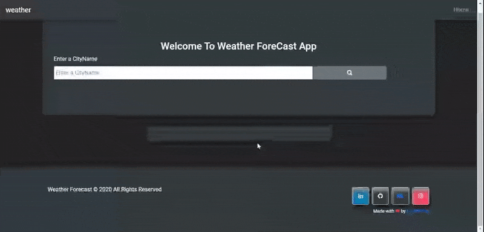

# weather-app-js

 
Applink :[weather](https://weather-vennilajs.netlify.app/)
Gitlink :[weather](https://github.com/karthikraji2020/weather-app-js)

## :film_projector: DEMO

###### Features
1. find weather ny entering city name
   

## Tech Stack
- vennila js
- bootstrap 4.3

